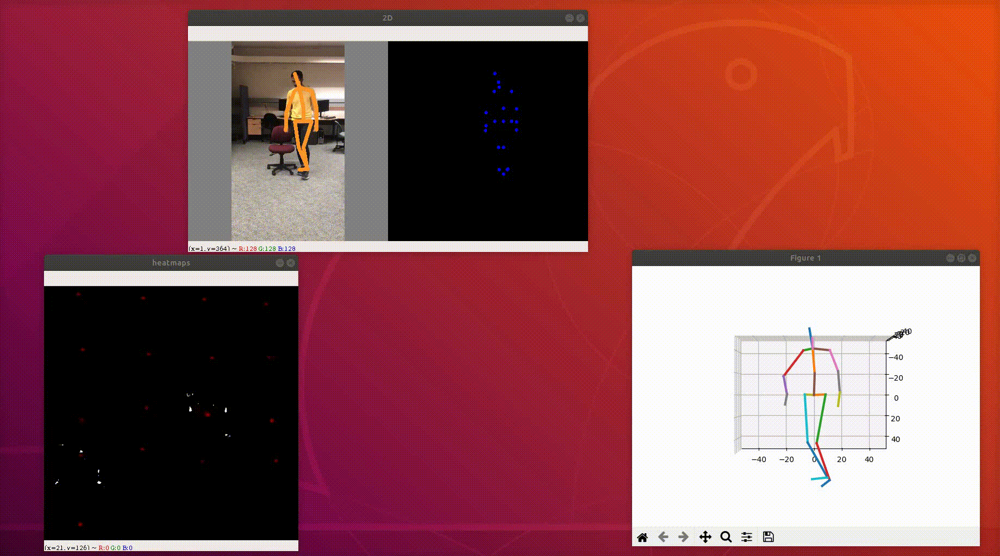

# 3D Human Pose Estimation

### Problem 
3D pose estimation from a single-shot captured from a monocular RGB camera. 
This approach is in real-time and robust to 
1. Various poses in the wild 
2. Multi-Person 
3. Can handle upto 15 FPS for video speed 
4. Illumination invariant. 

### Approach
Proposed solution is capable of obtaining a temporally consistent, full 3D skeletal human pose from a single RGB camera. The system has two main components.

+ First, a Convolutional Neural Network (CNN) that regresses 2D and 3D joint locations under the defined conditions of monocular image captured. It is trained on annotated 3D human pose datasets using additionally annotated 2D human pose datasets for improved performance in the wild.
+ Second, component blends regressed joint positions with a method of fitting kinematic skeletons to create a temporarily stable, camera-relative, complete 3D skeletal pose. The main idea of our method is a CNN that predicts the relative 3D joint positions of 2D and root (pelvis) in real time. 

Apart from this, trained model is able to: 
+ Crop human pose from a single RGB image in real time
+ Ensure temporarily smooth tracking over time. 

### Results

For futher details and more poses refer the project report.